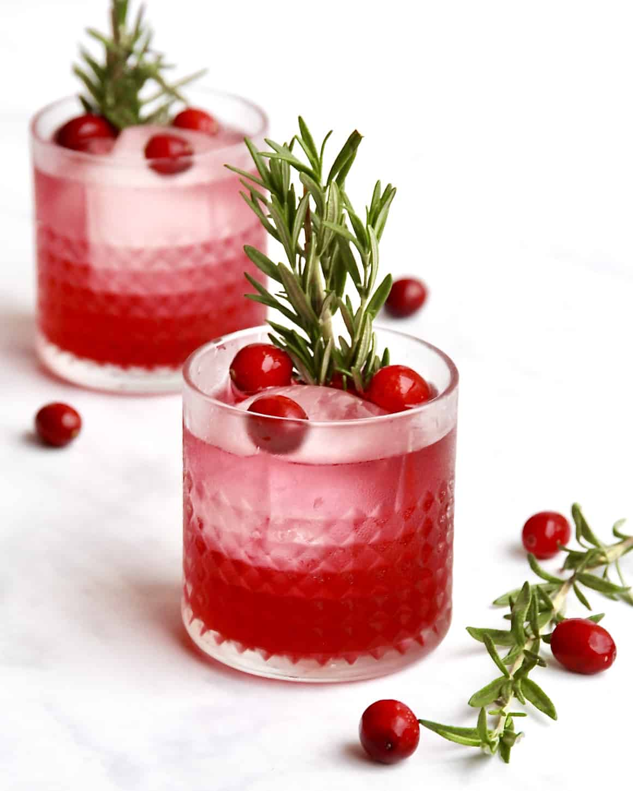
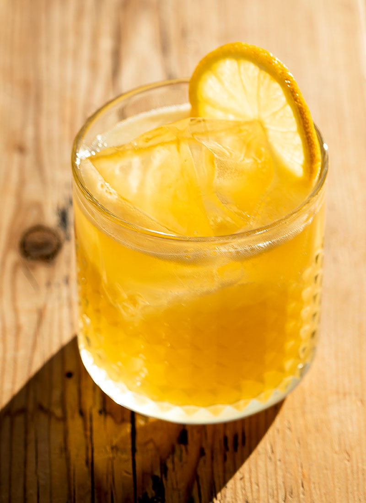
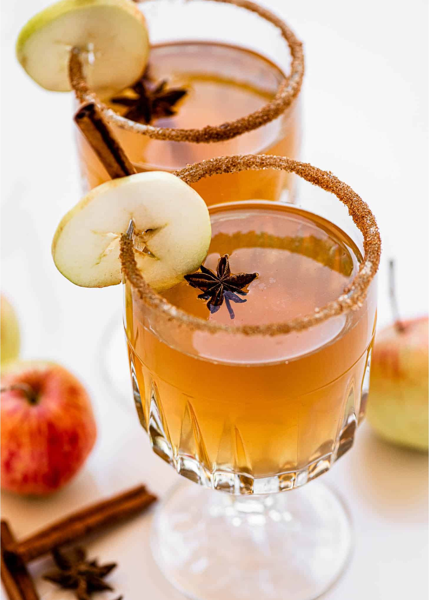
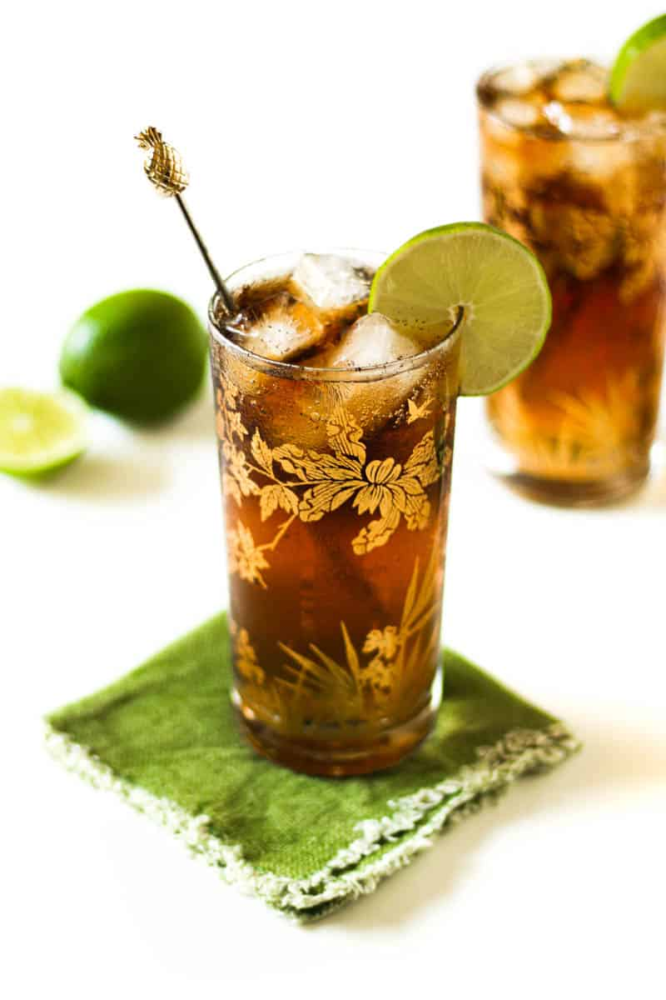
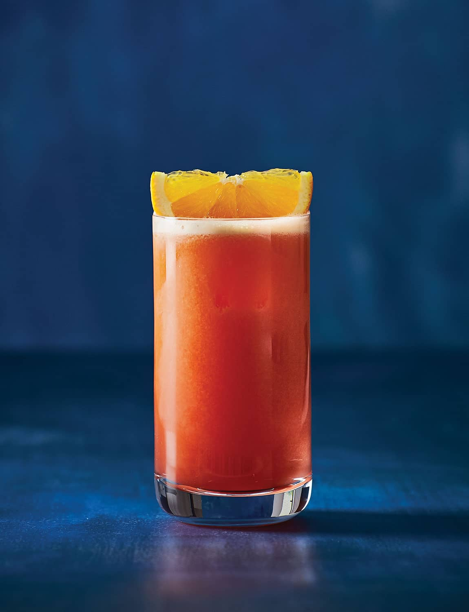
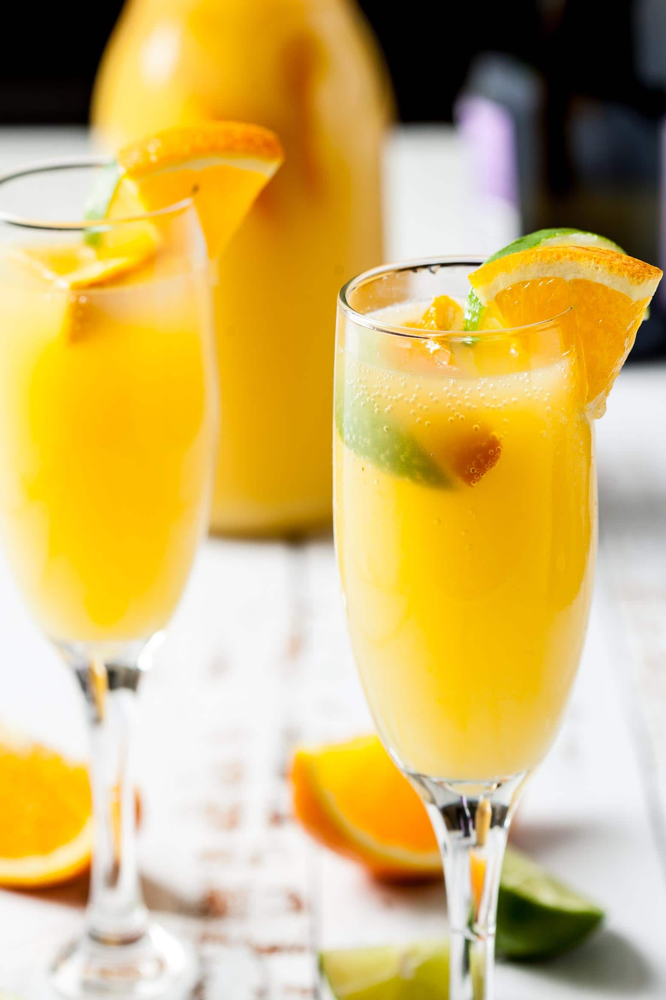
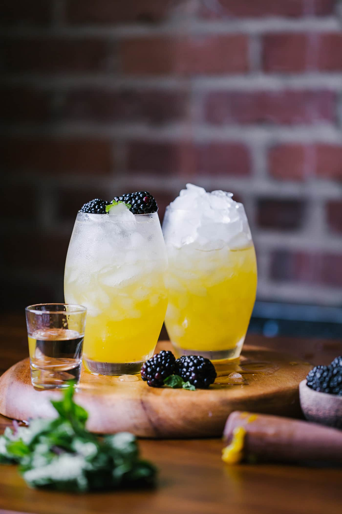
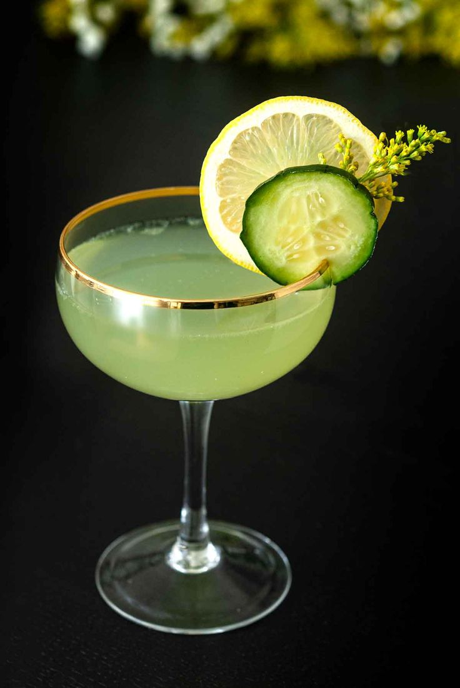
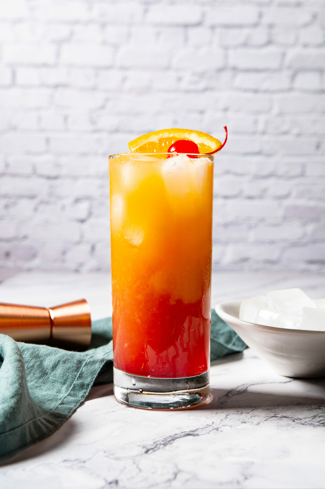
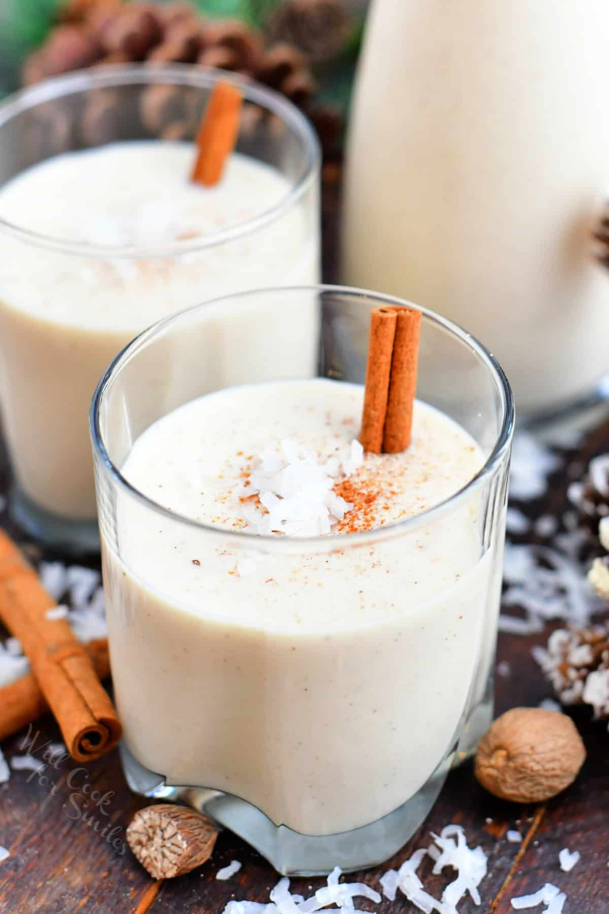

# Christmas Cranberry Cocktail
  - 1 ounce vodka
  - 2 ounces sparkling water or soda
  - 1 ounce cranberry juice
  - Fresh cranberries
  - Lime wedge and sugar for rim Ice

  {: .medium}

# Penicillin Cocktail
  - 2 ounces blended scotch
  - 1/4 ounce Islay scotch
  - 3/4 ounce honey-ginger syrup
  - 3/4 ounce freshly squeezed lemon juice
  - 3 inch piece of ginger root, peeled and sliced

  {: .medium}

# Spiked Hot Apple Cider
  - 2 ounces spiced rum or brandy
  - 6 ounces apple cider or juice
  - 1/2 teaspoon each of whole cloves and allspice
  - 1 apple, sliced
  - star anise
  - twig of rosemary
  - cinnamon sticks

  {: .medium}
# Censored in the Driveway
  - 2 ounces vodka or white rum
  - 1 ounce blue curacao
  - 1 ounce peach shnapps
  - sparkling lemon-line water or soda

# Cuba Libre
  - 2 ounces light or dark rum
  - 4 ounces cola
  - 1/2 a lime

  {: .medium}

# Dante's Garibaldi
   - 1 1/2 ounces Campari
   - 4 ounces freshly squeezed orange juice
   - orange wedge

   {: .medium}

# The Grand Mimosa
   - 2 ounces parkling wine
   - 1/2 ounce Grand Marnier
   - 2 ounces juice of your choice

   {: .medium}

# Mango and Blackberry Cooler
   - Ingredients for Syrup
        - 3 small ripe mangos, peeled and sliced
        - 2/3 cup of honey
        - 1 cup of water
   - Ingredients for Cooler
        - 4 ounces vodka of choice
        - 8-10 fresh blackberries
        - 1 can of sparkling water or club soda

  {: .medium}

# Green Apple Gimlet
   - 2 ounces gin
   - 2 ounces apple juice
   - green apple slices
   - mint leaves

  {: .medium}

# Tequila Sunrise
   - 1 1/2 ounces tequila
   - 3 ounces freshly squeezed orange juice
   - 1 teaspoon grenadine

  {: .medium}

# Coquito
   - 2 ounces white rum
   - 1 ounce simple syrup
   - 1 ounce fresh lime juice
   - 4 ounce coconut water or milk
   - 1 cup fresh mint leaves
   - 1 cup granulate sugar
   - 1 cup water

  {: .medium}

