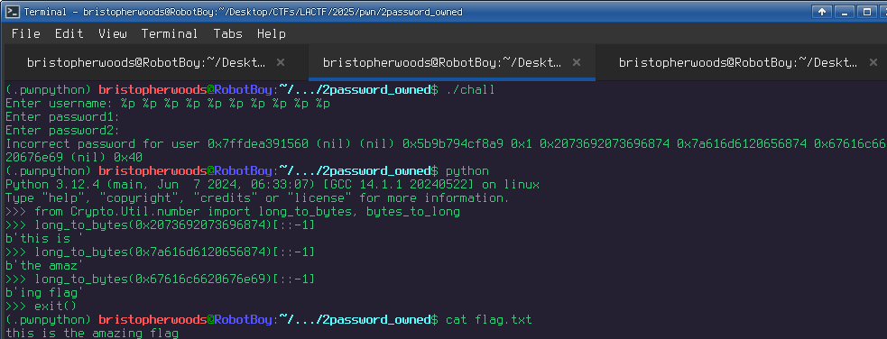

# A quick writeup for 2password, the first pwn challenge

This is just a quick show of how format strings work, sice this challenge essentially focuses on performing a simple exploitation technique on linux GLIBC's "printf"

## Format Strings

In the C programming language, you can use the printf function to print out values and strings as so.

```c
#include <stdio.h>

int main() {
        char buffer[10];
        int x = 5; 
        printf("Hello World\n");
        printf("I can print out a value of a certain declaritive type using format strings like this %d \n", x);
        
        fgets(buffer, 9, stdin); // Capture human input
        printf(buffer) // Danger here
}       

```

Due to the way the libc "printf" handles format strings, you could invariably manipulate the memory of the process if you only pass a string buffer to the function.

`printf(user-controlled-string-buffer)` is what you would be looking for.

In *2password*, you can see this vulnerability present itself at the end of the file "chall.c"

```c
#include <stdio.h>
#include <stdlib.h>
#include <string.h>

void readline(char *buf, size_t size, FILE *file) {
  if (!fgets(buf, size, file)) {
    puts("wtf");
    exit(1);
  }
  char *end = strchr(buf, '\n');
  if (end) {
    *end = '\0';
  }
}

int main(void) {
  setbuf(stdout, NULL);
  printf("Enter username: ");
  char username[42];
  readline(username, sizeof username, stdin);
  printf("Enter password1: ");
  char password1[42];
  readline(password1, sizeof password1, stdin);
  printf("Enter password2: ");
  char password2[42];
  readline(password2, sizeof password2, stdin);
  FILE *flag_file = fopen("flag.txt", "r");
  if (!flag_file) {
    puts("can't open flag");
    exit(1);
  }
  char flag[42];
  readline(flag, sizeof flag, flag_file);
  if (strcmp(username, "kaiphait") == 0 &&
      strcmp(password1, "correct horse battery staple") == 0 &&
      strcmp(password2, flag) == 0) {
    puts("Access granted");
  } else {
    printf("Incorrect password for user ");
    printf(username); // vuln here
    printf("\n");
  }
}
```

This challenge already loads the flag in memory, so if we  abuse this memory manipulation vulnerability, we can read its contents directly.

Check the examples here so you can get a better idea of the available "format" strings for printf
https://man7.org/linux/man-pages/man3/fprintf.3.html

Here are the most useful for exploiting format strings

d signed integer
u unsigned integer
o octal
x unsigned hexadecimal representation (32 bit)
f floating number
c character
s string of characters (will dereference the addy!)
p pointer address (good for 64 bit) <--- most important

n (special format string that initializes the address its currently pointing to with the  length of the current string in the buffer - a very dangerous feature as this sole format string lets us write data in memory)
hhn: write in 1 byte
hn : write in 2 bytes
n  : write in 4 bytes

An example shown here demostrates how printf reveals its memory when susceptible to this attack. 

input: %p %p %p %p %p %p %p

RESULT: (nil), 1, 0x44412231, 0x7ffffcc2, 0xc0000000, (nil), (your input but in byte representation)
-=-------
You would essentialy be able to see where everything is in memory at that frame of reference, and you can specify the element in this list without the redundancy of inputting %p like so 
-=-------
input: %5$p

RESULT: 0xc00000000 (using previous example's layout to show its convenience)


## Exploitation

Finally, putting it all together, if we input %p a few times into this chall, we will leak the flag as a long int. We can use python to quickly turn this into the original ascii text.



Viola!
If you want to learn more about writing data using format strings, please let me know. Here's a great resource I found.

[https://axcheron.github.io/exploit-101-format-strings](https://axcheron.github.io/exploit-101-format-strings)
