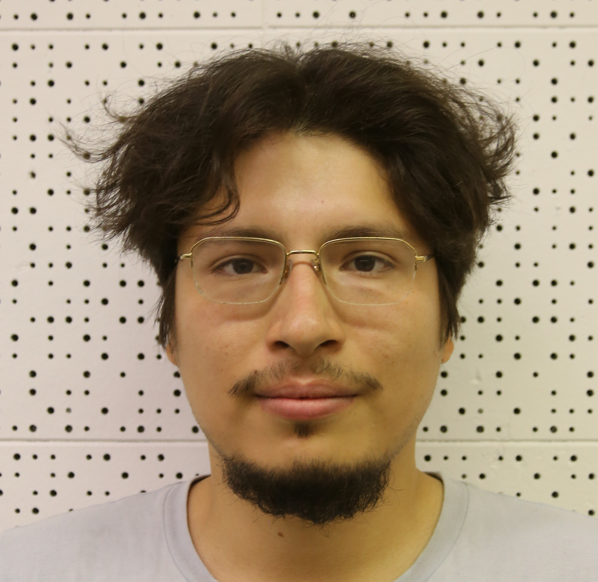
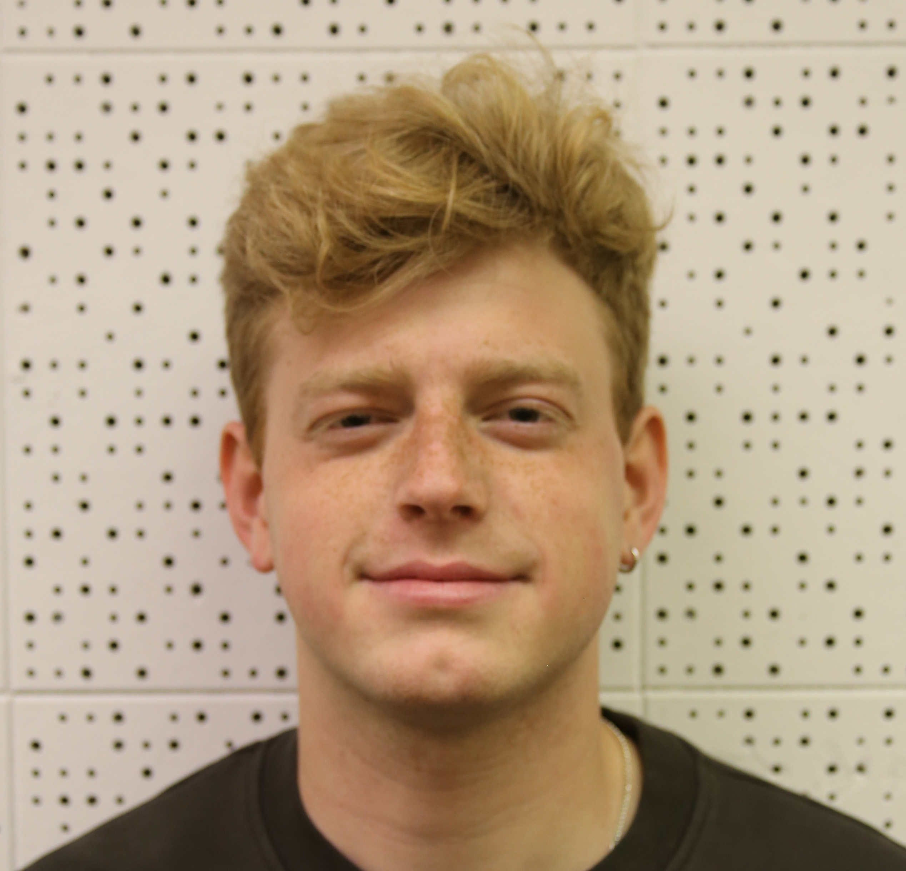
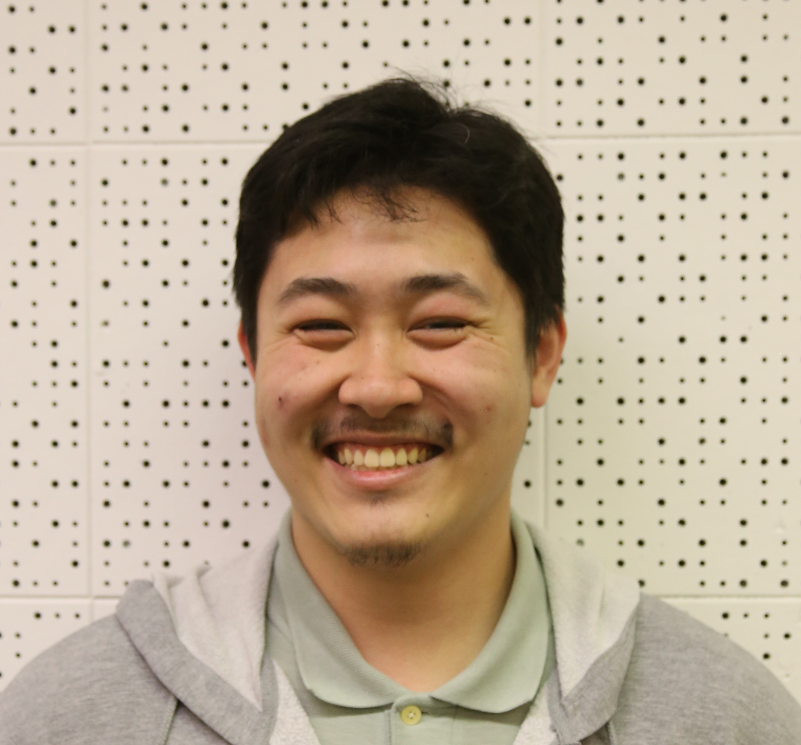
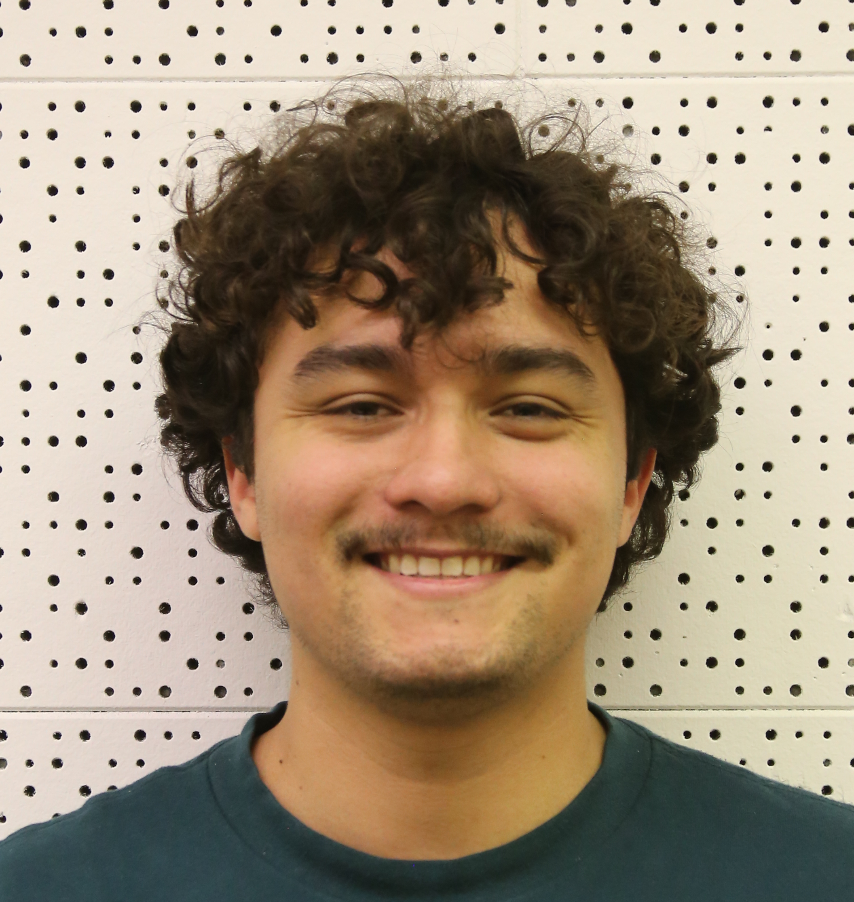

# About

Hello, we are a group of individuals curious about the world of cybersecurity. We would like to explore the endless 
possibilities it has on its plate. We're a small community at SFSU, that share the same interest of hacking the world and helping others do the same. On this site you will find details relating to our scheduling, blog posts, and resources created by the workshops we've organized. We cannot do more without the spirit of our club members. If you would like to join us in the future everyone is welcome.

# Officers

        

            
            
            
        

        

            
            
        

# Schedule

<iframe src="https://calendar.google.com/calendar/embed?src=sfsucyberclub%40gmail.com&ctz=America%2FLos_Angeles" style="border: 0" width="400" height="400" frameborder="0" scrolling="no"></iframe>

