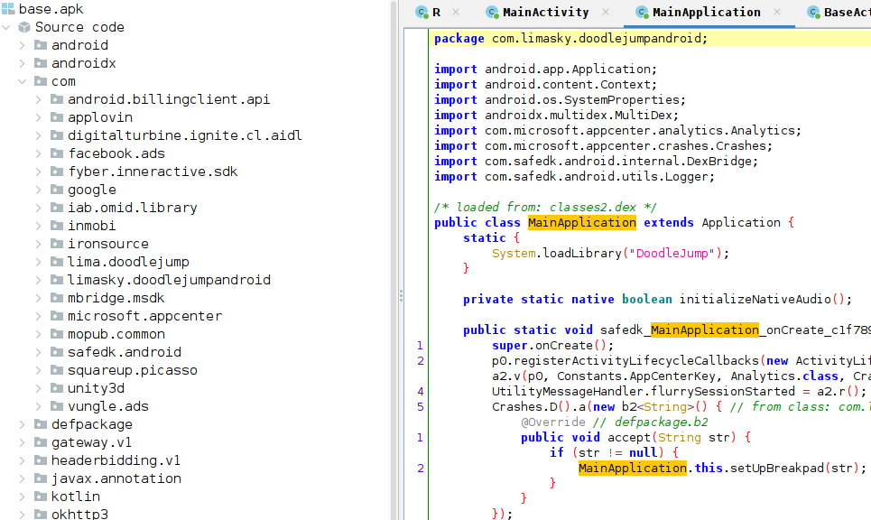

# Welcome to Android 101 Reverse engineering

After spending some time reviewing powerful tools to reverse engineer Android applications, I thought it would be nice
to share this knowledge. I haven't been able to find *many* good resources on debugging non-rooted phones, so in this guide, I will
be providing further information on parts _others have left out_

There are many open source tools on github, and I implore you learn more about them (as should i :P) - but for now, please try setting up the environment manually. I will try to create a docker image providing all the tools at some point.

For the sake of simplicity and fundamentals, we will spend time reverse engineering Doodle Jump - ever heard of it? You play as a
jumping platformer that you can control with your phone's gyroscope. The goal is to get as high up as you can.

## Tools you'll need for the job
- adb
- zipalign
- apksigner
    - [android-studio](https://developer.android.com/studio) (this comes with all tools above)
- [apktool](https://apktool.org)
- keytool
- jarsigner 
    - you should have these* natively installed if you have a Java JDK
- bettercap (optional)
- Frida
    - pip install Frida
- [jadx](https://github.com/skylot/jadx)
- [ghidra](https://github.com/NationalSecurityAgency/ghidra)
- LIEF
    - pip install lief


### Theory
 Before we start taking apart our android phone, we need to understand the system's architecture

Source -> [https://mobisec.reyammer.io/slides](https://mobisec.reyammer.io/slides)

### Android apps do not have a single entry point, but rather multiple depending on user actions. AKA there is no "main".
### The following are objects that contain entry points based off particular actions.
### Every object type also has a life cycle that is clearly defined by google's smoogles [documentation](https://developer.android.com/guide/components/activities/activity-lifecycle)

* Activity  

When the user interacts with the app in any way defined by the GUI, the activity
 class can be launched to deal with its request

* Service 

A background process running regardless of user interaction. This could be anything that does not need to run in the foreground

* Broadcast Receiver

Whenever there is a broadcasted event issued by android (like shutting down the phone), the app can receive it 
and respond to it by using this object class that defines what action needs to be p
erformed during such event. They are initialized when the user starts the application for the first time. They persist even after the phone restarts unless the user 
manually disables them.

* Content Provider 

A layer that handles retrieval and trasmission of data from the app's database.
Usually these databases are structured with SQLite and the Content Provider abstracts interfacing it.

* Intents 
When applications want their components/other applications to communicate with each other, they can
 use this special class to initiate the protocol. The data that is sent using an Intent is called a Bundle.
|
|
|
- Explicit -> specifies the exact full package name of the component that it wants to communicate to
- Implicit -> a generic intent that can be picked up by any other avaliable service.
Intents are used in almost all components of an app, so this one's especially important.

Each version of android is identified by a number known as an "API level"
If an app requires a minimum API level of, say, 31, then your android build
will have to be an API level >= !

Most apps will have their minimum API level set pretty low relative to the latest version, but 
they will also provide information on what API version they were designed for - known as the target API.

### Android's Managers

Shown in the picture above, Android is built off of the Linux core. However, when there are certain syscalls requesting 
sensitive/special information that is device-specific, such as your smartphone, android uses a special 
component called a "Manager" that resides in the userspace

An example would be your physical location - something that is exclusive to your phone's capability of obtaining.
An app would invoke the android api through a manager that provides this information. While doing so, the interaction will stay within the sandbox due to the "Manager" also being in userspace. The Manager tends to behave
like its own app, but with slightly higher privileges.

Behind the scenes, this interprocess communication is administered by a IPC/RPC called Binder
Intents are defined by binder calls, so apps use them when they want to communicate with these "Managers", and really any other app.

And with IPC/RPC communication, a special device driver in the kernel uses ioctl to administer communication between the userspace-unprivileged and the userspace-privileged
See image below, and here's more information on what a [device driver](https://en.wikipedia.org/wiki/Device_driver) is if you're starting fresh.


Source -> [https://mobisec.reyammer.io/slides](https://mobisec.reyammer.io/slides)

* * * 

With some of these fundementals out of the way, let's get started with retrieving Doodle Jump from our phone. 
>> Make sure to enable USB debugging in the [developer settings](https://developer.android.com/studio/debug/dev-options).
>> and make sure to use a USB Micro cable with a data line.

## Using ADB

Our first tool for teh job is called ADB. Created by android developers for app developers, this tool allows you to interface between your
android device and host machine. We can use ADB to our advantage when we want to retrieve, install, or modify apps. 

To start it up, you will need to run any command for adb, provided that your device is connected and ready. 
`sudo adb devices` (run with sudo to prevent unauthorized error)

This will list out any connected android devices (your phone might ask for further permission from the user to accept the host machine's request for connection).

Since we're going to be taking apart an app from the phone, we're going to use `adb pull` to retrieve it.

Before we do that, however, we should first find where it's located within our phone's filesystem.
- Run `adb shell pm list packages` to list the full package name of each app registered on your android.
  - Use `grep` so that you can filter down this list to the specific app you are looking for.
- Run `adb shell pm path <package name>` to acquire the full path

Once you have the full path, you'll see a 'base.apk' file at the end of it. This is quite literally your app, so go ahead and
`adb pull <path of package> .` and you should be ready for the next step!

>> _Note for future reference_ - If for some reason you mysteriously encounter a "no such file or directory error" despite properly addressing the path, you may want to try entering your android's shell with `adb shell`, copying the base.apk elsewhere (like /sdcard/)

>> `adb shell cp <original path of base.apk> /sdcard/` or (while you're in the android shell) `cp <original path of base.apk> /sdcard/`, and trying `adb pull` again with the new path.

## The framework of an app

As we seen from the image above, an app is mostly comprised of java bytecode and c++ native libraries that the android system
can understand and run. Let's talk about what apps are formatted in - APK

An apk is essentially just a zipped package, you can extract all of its raw contents using
`unzip base.apk -d folderoutput`

You will see a folder with *usually*, these subfolders in it.

* AndroidManifest.xml

A super important file dictating the properties and permissions of an app.
Has information that will help identify many components of an app's behavior, and most importantly, specifies
the first class that it will run. There are no entry points in the OOB of android app development, as
different components run asynchronously from each other, but when an app needs to start for the first time, it will need a 
"launcher" to jumpstart everything else. The android manifest file will provide this information, but you can also use it to modify interesting properties, so I encourage you to check this on your own...

Check out the [unmangled](#unmangled) version of AndroidManifest.xml in DoodleJump


The image above shows a declaration of the class that start when launching the app. Indicated by the red outlines, the class "MainActivity" is specified
as the MAIN LAUNCHER.

* /assests/*

contains the app's sprites or media to be preseted

* /res/*

used for custom styles in dimenstions, color, and various other components
to the UI of the app.

* /resources.arsc

maps the resources to a numerical identifier for the app to use

* /classes.dex

contains java bytecode (dalvik or ART encoded) for the app to run. Usually is the heart of the application
and compiled in either java or kotlin, does not matter.

* /libs/

shared libraries to execute native code, usually compiled in C or C++ for game engines or various
other applications. ELF formatted and organized based off architecture (there are duplicates of the same libraries to
maintain portability).

* /META-INF/

A certificate folder in order to verify the validity and authenticity of the app before being able
to be installed on an android's system

* MANIFEST.MF file with SHA-1 or SHA-256 hashes for all files inside the apk
* CERF.SF file, similar to MANIFEST.MF but signed with an RSA key instead
* CERT.RSA file containing the public key to sign apps and be verified by CERT.SF

You can use openssl like so to read more information about the public key issuer
`openssl pkcs7 -in META-INF/CERT.RSA -inform DER -print`

<div id="manifest"></div>
Apps need to be signed by the author for integrity using a digital certificate. Almost similar to 
the certificates you get from https, but only used to validate one end. For non-system/priviledged apps, the
android system doesn't compare the certificate with its root authorities. We will come back to this later for further explanation


When you unzip an apk, you'll find the contents mentionned above, but everything is going to be mangled when you try reading some of it, so we'll need to use another tool for the job... 
<div id="unmangled"></div>
## Using ApkTool

ApkTool allows you to unzip apk packages while retaining the contents in human-readable form.

### Uncompress using ApkTool
After retrieving your app from your phone using adb, use apktool on it like so.

`apktool d base.apk`

You will see the generated folder to be a little more organized than when we used unzip, and the AndroidManifest.xml file should now
be readable.

But what's also readable is the contents of the program itself! 

Apktool will generate a more human readable version of the java bytecode called **smali**. 
You can think of it as assembly for java, but a little more readable compared to actual cpu instructions.


__(This is smali assembly, feel old yet?)__

Now to remind  you that this is not what Java's LVM sees when its processesing bytecode, it's simply 
a visual construct. But if you think this is where the road stops for decompilation, you got another thing coming.

(Make sure to perform this step as we'll come back to the apktool's decoded package later)

## Using Jadx

Jadx, unlike apktool, will completely decompile the byte code into Java lang. 

Although jadx isn't immune to anti-debugging techniques and obfuscation, many android apps do not employ such 
practices. Doodle jump, for example, has most of its symbols avaliable. 

We can start by running the command `jadx-gui base.apk` to get the decompilation process going.



__using jadx's gui, you can lookup cross references of any given field with 'x', and search text fields under the 'Navigation' tab__

Once it's finished, you'll see something like this. The names on the left indicate all the classes
 that are loaded with the app. Most of these are the default classes that get added to most apps, but to find developer defined code, we need to look into the com.limasky package. 

 Opening one of the "MainActivity" classes, we see something unusual about this particular app,
 in that it loads a native library directly upon launching. Denoted by
`System.LoadLibrary("DoodleJump")`

We should investigate this native library, which is located in the apk's /lib/ folder. Depending on your phone's architecture, 
you may need to choose either arm64 or armeabi, but most phones are arm64. So, with blind faith, we will be looking at the native library through this architecture.

<div id="libDoodle"></div>


## Ghidra

Ghidra is used for reversing and decompiling many binary types, so it comes to no surprise as being the most useful *free* tool for this
particular scenario. We want to decompile the binary so that we can take a look at the function symbols (if there are any), and analyze any interesting code patterns. If you've never used ghidra before, we strongly advise to do a little bit of your own research (and __in the future we'll try to provide a ghidra workshop__). For now, I will assume that you know how to drag and drop a file to ghidra, start it up, and lookup function names once its done decompiling.

<div id="native_library"></div>


For Doodle Jump in particular, I tried to understand why it needed a native library. There were many functions, but many were unecessary to the game's core functionality. I used the function filter at the bottom left to check for any functions prefixed as "Java_", as these are ones that are defined by the developer to be used as java methods __please fact check me on this__. 

I found an interesting function called "runGameLoop", which allowed me to quickly define an entry point to the next step..

* * *

## Static analysis recap and introduction to Frida

So far we've covered tools on how to retrieve phone apps, open them up, and read their code. But what if we want to **debug** the app during runtime? This introduces us to dynamic analysis and the process of hooking functions to observe their states in realtime. In this section, we'll be covering the crucifix of debugging apps on a non-rooted phone by using a powerful instrumentation library called **Frida**. This library has many components to it, and although useful outside the context of android, we're going to use it to do the following.

* Hook the native library with our Frida "Gadget".
* Implement a script to analyze the app's runtime state.
* Implement a script to modify the app's variable and see real-time effects.
* ~~Create a Java hook, defined in JS, and inject it into our function.~~
* ~~Create a native library hook, defined in C, and inject it into our function.~~
* Provide further resources on advanced Frida API Usage. 

For this particular exercise with Doodle Jump, we're going to do more with our Android app and modify our apk so that 
we're able to use Frida. Because we're specifically working with a **non-rooted** android phone, we need to use a Frida
"Gadget", which is essentially going to act as another native binary that gets sideloaded when [libDoodleJump.so](#libDoodle)
gets called. Below is a control flow graph I made to show Doodle Jump's execution flow with Frida loaded.

>> Make sure to use the decoded APK that we got from apktool earlier. If you're following along, we're going to be using 
>> that to repack the content and send it off to our Fode *Phone*


In order to sideload `libDoodleJump.so`, we should first understand that ELF binaries dynamically link to other binaries when
**referring to a function that does not exist**. For example in C, when I use `printf`, this is going to be defined by the standard library. When I compile a program that uses this function it will, by default, dynamically link it to the standard library. Let's take a further look at what I mean. 

Go to lib/arm64-v8a/ and run
`readelf -d libDoodleJump.so`

You will see the following at the top.


You can see that doodle jump loads additional native libraries to run its main one, so the idea is to inject our frida shared library to this binary to complete the sideload.

For this code snippet, you could either just download the gadget binary like I did or if you're looking for a particular 
gadget version (because sometimes it may not work depending on the API level of the android system), try [going here for the latest releases](https://github.com/frida/frida/releases)

```
wget https://github.com/frida/frida/releases/download/16.2.1/frida-core-devkit-16.2.1-android-arm64.tar.xz 
unxz frida-gadget-16.2.1-arm64.so.xz
```
Move this gadget to our lib native folder

```
mv frida-gadget-16.2.1-arm64.so path/to/apk/lib/arm64-v8a/libfrida-gadget.so
```

Now to modify libDoodleJump.so to sideload libfrida-gadget.so. We're going to be using an ELF parser that will
help us inject this library easily using three lines of python. This library is called LIEF, and it's relatively straightforward 
and useful.

```python
import lief

libnative = lief.parse("libDoodleJump.so")
libnative.add_library("libfrida-gadget.so") # inject
libnative.write("libDoodleJump.so")

# Reference - https://fadeevab.com
```

After performing this injection, try running `readelf -d libDoodleJump.so` again, you'll see frida-gadget.so as part of the 
linked library list.


With that, we can finally repackage our apk and install it back to our phone.

## Repackaging our APK

Now to repack our APK, you remember [when we decoded/decompressed our APK using apktool?](#unmangled). We're going to be using
apktool again to repack our apk back to it's original format.

Once you have everything in place, the command is as simple as running
`apktool b <folder_of_unpacked_apk>`

The output will be generated in \<folder\_of\_unpacked\_apk\>/dist

Make sure to put it in a new folder where you can have a clean workplace for the next steps...

## Signing our APK

We can't install our apk to android just yet because of what we mentionned earlier about the [Manifest file](#manifest).
We modified the contents of the apk, so we need to go through the process of generating a signature and re-signing all
the files. Android does not care for who signs the app, it just needs it signed so that it can validate integrity for developers using the App Store to publish their apps.

The process is annoying, so below are a set of commands that you can run to sign your apk! Newer requirements need an additional
signing step which I have also provided.
```sh
# 1. This generates our certificate, and will prompt you for key issuer information, so just fill it out with random info
# In my certificate, I simply filled everything out with the word 'password' so I don't have to worry about forgetting
keytool -genkey -v -keystore my-release-key.keystore -alias alias_name -keyalg RSA -keysize 2048 -validity 10000
# 2. this will start signing base.apk and re-digesting the files, including the ones we modified
jarsigner -verbose -sigalg SHA1withRSA -digestalg SHA1 -keystore my-release-key.keystore base.apk alias_name
# 3. part of android tools, this will is the first phase of signing
zipalign -v 4 new_base.apk signed_base.apk
# 4. convert the certificate you created earlier into a jks format for the next phase of signing
keytool -importkeystore -srckeystore my-release-key.keystore -destkeystore keystore.jks -deststoretype jks
# 5. second and last phase of key signing, use android tool's apksigner and your jks formatted certificate to finally sign it off!
apksigner sign --ks keystore.jks --ks-key-alias alias_name --ks-pass pass:password --key-pass pass:password signed_base.apk
# The completely signed apk will be called signed_base.apk
```

You finally have your signed apk and you can install it to your android phone.
>> Make sure to uninstall the original app on the phone

Then it's just `adb install signed_apk` from there!

But now to see if Frida actually works, we'll need to start the app on our phone.

## Checking Frida's hook

When you start the __frida hooked__ app on your phone, you should see a black screen, as Frida's gadget is configured by default to freeze the app until
the host machine connects.

Now, while having the hooked application open, run `adb logcat | grep Frida` on your host machine. This will confirm that Frida is properly working. You will see android log information, but filtered for any messages related to Frida.

If successful, you will see Frida listening on the default port of 27042.


## Launching Frida on the host machine

While having an open port configured, Frida will also create a running process in the android system.
On your host machine, run `frida-ps -U`, this will list all the processes running on your attached android device. Filter the search
with `grep` and the keyword `Gadget`, to see this process that frida has created on the device.

>> __(you can also try remotely connecting to Frida by following the [steps here](https://flippingbitz.com/post/2018-09-21-objection-remote-device-app-hook/) to get adb connected remotely, your android version might not support it but worth a shot)__


Frida uses this process to attach Frida from the host machine to the device. Once you're ready, it's as simple as running
`frida -U Gadget`

You will be presented with a CLI interface that looks like this 

```
     ____
    / _  |   Frida 16.2.1 - A world-class dynamic instrumentation toolkit
   | (_| |
    > _  |   Commands:
   /_/ |_|       help      -> Displays the help system
   . . . .       object?   -> Display information about 'object'
   . . . .       exit/quit -> Exit
   . . . .
   . . . .   More info at https://frida.re/docs/home/
   . . . .
   . . . .   Connected to SAMSUNG SM G935A (id=409e6656)

[SAMSUNG SM G935A::Gadget ]->
```

You will also see your app resume and launch, as this signifies that you've done everything correctly and you're ready to move to the next steps.

## Frida CLI quick and dirty interface navigation

`frida -l script.js -U Gadget` Loads a javascript file during the attachment process of frida - good for when you need to analyze
functions that run once during launch.

`%load script.js` After you've launched frida and already started the program, use %load in the CLI interface like so to load a script during runtime.

`CTRL+D` Will quit the application, just in case you're in a forever loop and you can't type `exit` to quit.

## Implement a script to analyze the app's runtime state.

Frida's true power comes from being able to use it like a scripting language. If you've ever used CheatEngine before or are familiar with programs like it, Frida can be used in a much similar way. You can read and modify variable states, as well as insert your OWN code directly into the process. There are limitations, however, for certain module you can hook. Because we're working with a non-rooted device, there may be a few libraries that are protected from memory writes ( __please fact check me on this__), but for the most part, Frida gives you complete control of the hooked process.

For this exercise, we're going to analyze the arguments that get passed through the native library [we looked at earlier](#native_library). When static analysis gives you the jeeby weezy, you can observe the states during runtime and **see if they change depending on what actions you perform**. 

Frida can be interfaced using a few apis, but is the most customizable/convenient using javascript. The [API documentation is extensive and I encourage you to read more about it here and in the references section of this blog](https://frida.re/docs/javascript-api/), but for now, we'll analyze the function from that native library we were looking at and use example code that actually works to modify the values. 

We saw on ghidra's function symbol that the name of the function was `Java_com_limasky_doodlejumpandroid_NotificationCenter_runGameLoopNative`, so we're going to be hooking to this function and analyzing what arguments are getting passed to it. Be mindful of the functions you are trying to hook, as they may only be called once and Frida won't be able to intercept it.


```javascript
var instance = null

// Will attach a java thread to the LVM
Java.perform(() => {
        var has_activated = false;
        
        // Making sure this runs only once to avoid creating infinite hooks!
        if(!has_activated) {
              // Will fetch the address of the function we found earlier 
              // This function exists in the libDoodleJump.so native library that we found earlier in /lib/arm64-v8a
              const f = Module.getExportByName('libDoodleJump.so', 'Java_com_limasky_doodlejumpandroid_NotificationCenter_runGameLoopNative');
              console.log("obtained libdoodle export of ", f);
              
              // Uses Frida's Interceptor to create a hook between the function call and Frida, we can define 
              // another function that will run before the main one
              Interceptor.attach(f, {

              // Defines a function that starts right before the main GameLoop, will capture the arguments passed to it
                onEnter(args) {
                // You can't use .length on args! you should use the ghidra reference to tell you how many arguments there are
                // but I am sure the arguments are being delimited by something, so you could traverse it without knowing the length
                // somehow..
                     console.log(args[2]); // Will send the value to your Frida CLI client

                }
                
                // One could also add ,OnLeave(retVal) to hook after the main function has been performed
              });
                console.log("We set up an interceptor here");
         }
        has_activated = true;
});

```

I saved this script as "doodle-hack-check.js" on my end, so when I try running this, here's an interesting 
output.


```
(.pwnpython) bristopherwoods@RobotBoy:~/.../Frida-scripts$ frida -l doodle-hack-check.js -U Gadget
     ____
    / _  |   Frida 16.2.1 - A world-class dynamic instrumentation toolkit
   | (_| |
    > _  |   Commands:
   /_/ |_|       help      -> Displays the help system
   . . . .       object?   -> Display information about 'object'
   . . . .       exit/quit -> Exit
   . . . .
   . . . .   More info at https://frida.re/docs/home/
   . . . .
   . . . .   Connected to SAMSUNG SM G935A (id=409e6656)
Attaching...                                                            
obtained libdoodle export of  0x70aa07c0d4
We set up an interceptor here
Let's do something freaky
0x0
0x0
0x0
0x1
0x1
0x1
0x1
0x1
0x1
0x0
0x0
0x0
0x0
0x1
0x1
0x1
0x1
0x0
0x0
0x1
[SAMSUNG SM G935A::Gadget ]->

Thank you for using Frida!
```
May not seem like much, but the variable was changing from 0x0 to 0x1 upon the taps I make on the screen! This just shows the proof in the pudding of how we can hook and observe values - it really helps to understand the behavior of a function. I can go back to ghidra and fill out that 2nd parameter as one that has something to do with controlling user tap input. What if I modify the value?

## Implement a script to modify the app's variable and see real-time effects.

After playing around with different integer values, here's what happens upon launching the new script.
```
// I just added this line before the console.log(args[2]) statement, using the same script!
args[2] = ptr(0x5);
```

(Trying out asciinema, really cool recorder :])
<script src="https://asciinema.org/a/TzuMMo3384weXrz08CtUQ6ydc.js" id="asciicast-654902" async="true" ></script>
What happens during runtime..


* * *

* ~~Create a Java hook, defined in JS, and inject it into our function.~~
* ~~Create a native library hook, defined in C, and inject it into our function.~~

I crossed these out because I will be providing resources that will cover these points 
much more thoroughly. I appreciate the people who took their time to document their examples with frida, as 
there aren't too many that are easy to understand for someone starting out

Below are a couple more code snippets of other ways to explore the process once you're hooked

1. Java hooking and re-calling functions defined by the program

```javascript
var instance = null
var has_started = false;
// Creates a java thread and attaches to main module
Java.perform(function() {
       
        /*
         Unecessary step but makes sure that we mention the classname correctly with 
         its full path to then pass it to the Java hook. This will iterate through all
         classes that have been loaded with our app during runtime and will find one that 
         has a partial string match of "MainApplication" - careful if multiple classes contain the same naming convention
        */
        Java.enumerateLoadedClasses({
        onMatch: function(className) {
                if(className.match("MainApplication"))
                {
                        instance = className; 
                        console.log(className);
                }
        },

        onComplete: function() {
                console.log("Done!");
                }
        });
      
        // Just making sure not to run this more than once
        if (has_started)
        {
          return;
        }

        const main_app = Java.use(instance);
        console.log("Signature is ", main_app);
        console.log("function is ", main_app.isUsingAwesomePlayer);

        // Setup an java hook to observe a programs behavior and modify components, similar to interceptor
        main_app.isUsingAwesomePlayer.overload('android.content.Context').implementation = function () {
                console.log("Am I being called?")
                var ret_val = this.isUsingAwesomePlayer();
                send(ret_val); // Same as console.log

        }
        // ALTERNATIVELY
        
        // You can also do the following, to call a function loaded within the program
        var Log = Java.use("android.util.Log")
        Log.d("Frida","Hello guys I am cool, check adb logcat to see me");

        has_started = true;
        });

```

2. Java memory searching and looking for specific values


```javascript
var m = Process.enumerateModules();

// 0x4616, value is in little-endian hex representation 
// In this example I was looking for my doodlejump highscore ;O
const pattern = '16 46 00 '
var foundList = []
for (let i = 0; i < m.length; i++) {
        Memory.scan(m[i].base, m[i].size, pattern, {
                onMatch(address, size) {
                        console.log("Found it, at ", address);
                        foundList.push(address) 
                },
                onComplete() {
                        console.log('Scan complete');
                }
        });
}

// Do someting with the values here
for (let i = 0; i < foundList.length; i++) {
        console.log(foundList[i].readInt());
}

```

# Recap

I hope putting these tools to action provides a better understanding of how to use them to their fullest potential when reversing
android devices. 
The possibilities are endless, like **reversing a pay-to-walk app and spoof your gps for free m0ney ;)**
I greatly appreciate the resources I have used to compile this blog. Below are the sites and work I borrowed to create this
for the gator swamp. Thank you for reading this all the way through! Until again.


* * *

## References

[mobisec.reyammer.io - Yanick Fratantonio / Premium-Quality Italian](https://mobisec.reyammer.io)

[jlajara.gitlab.io/Frida-non-rooted - Jorge Lajara](https://jlajara.gitlab.io/Frida-non-rooted)

[securitygrind.com/ssl-pinning-bypass-with-frida-gadget-gadget-injector-py - Cristian R.](https://securitygrind.com/ssl-pinning-bypass-with-frida-gadget-gadget-injector-py)

[codeshare.frida.re/browse - Frida](https://codeshare.frida.re/browse)

[fadeevab.com/frida-gadget-injection-on-android-no-root-2-methods/ - Alexandr Fadeev](https://fadeevab.com/frida-gadget-injection-on-android-no-root-2-methods/)

[lief.re/doc/stable/tutorials/09\_frida\_lief.html - Lief](https://lief.re/doc/stable/tutorials/09_frida_lief.html)

[evilsocket.net/2017/04/27/Android-Applications-Reversing-101/ - Simone](https://www.evilsocket.net)


### Easy to follow Frida References
[learnfrida.info/basic\_usage/ - Fernando Software Engineer at VirusTotal](https://learnfrida.info/basic_usage/)

[www.youtube.com/watch?v=RJXsvAjZl9U - LaurieWired Hooking Java Methods with Frida](https://www.youtube.com/watch?v=RJXsvAjZl9U)

[www.youtube.com/watch?v=N2JtRXCofUU - LaurieWired Hooking Native Methods with Frida](https://www.youtube.com/watch?v=N2JtRXCofUU)


