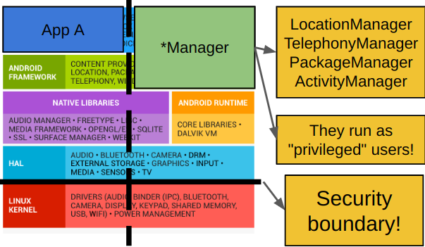
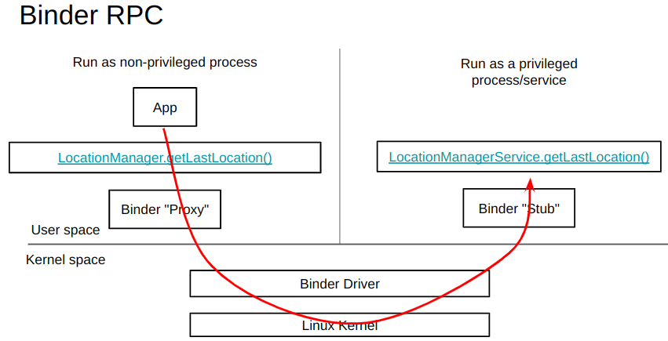
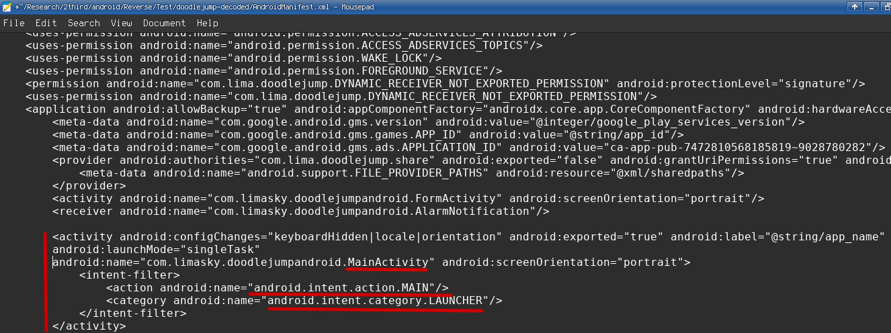
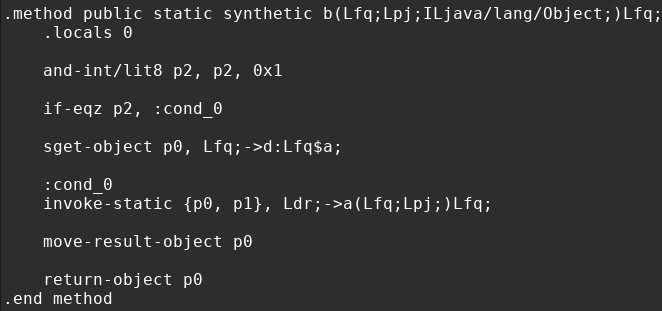
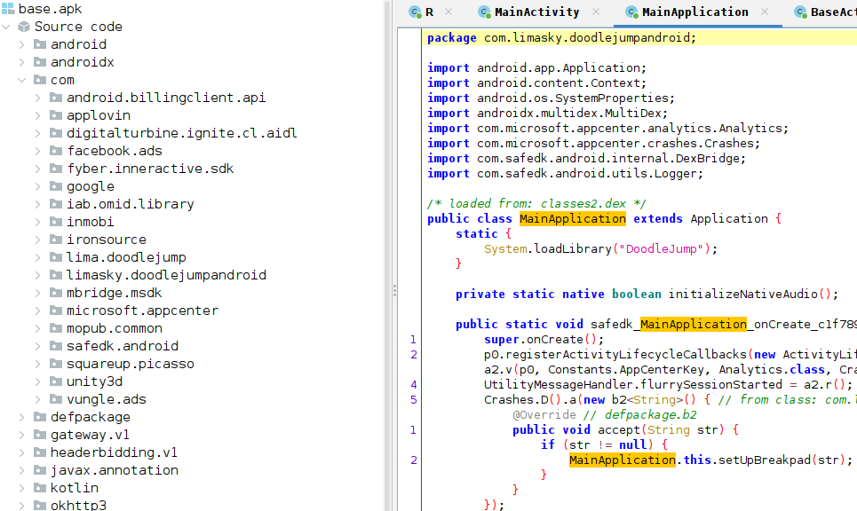
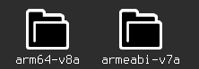
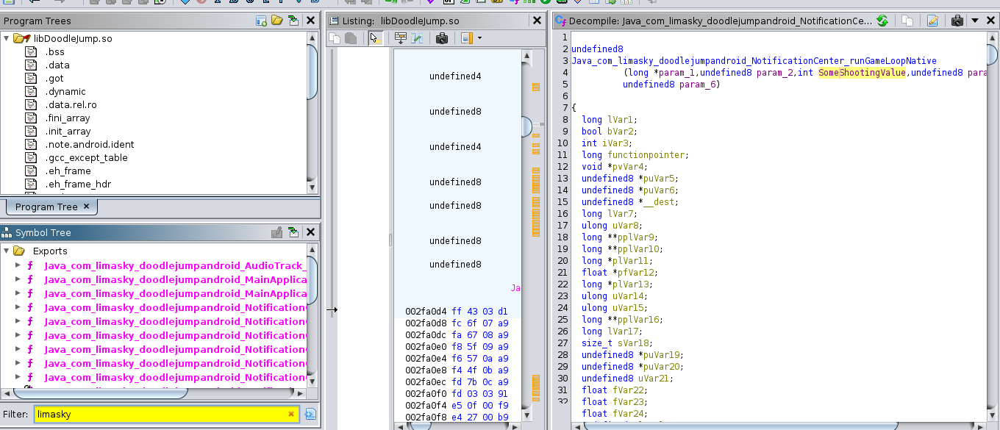

# Welcome to Android 101 Reverse engineering

After spending some time reviewing powerful tools to reverse engineer Android applications, I thought it would be nice
to share this knowledge. I haven't been able to find good resources on debugging non-rooted phones, so in this guide, I will
be providing further information on parts _others have left out_

There are many open source tools on github, and I implore you learn more about them (as should i :P) - but for now, please try setting up the environment manually. I will try to create a docker image providing all the tools at some point.

For the sake of simplicity and fundementals, we will spend time reverse engineering Doodle Jump - ever heard of it? You play as a
jumping platformer that you can control with your phone's gyroscope. The goal is to get as high up as you can.

## Tools you'll need for the job
- adb
- zipalign
- apksigner
    - [android-studio](https://developer.android.com/studio) (this comes with all tools above)
- [apktool](https://apktool.org)
- keytool
- jarsigner 
    - you should have these* natively installed if you have a Java JDK
- bettercap (optional)
- Frida
    - pip install Frida
- [jadx](https://github.com/skylot/jadx)
- [ghidra](https://github.com/NationalSecurityAgency/ghidra)

### Theory
 Before we start taking apart our android phone, we need to understand the system's architecture

Source -> [https://mobisec.reyammer.io/slides](https://mobisec.reyammer.io/slides)

### Android apps do not have a single entry point, but rather multiple depending on user actions. AKA there is no "main".
### The following are objects that contain entry points based off particular actions.
### Every object type also has a life cycle that is clearly defined by google's smoogles [documentation](https://developer.android.com/guide/components/activities/activity-lifecycle)

* Activity  
When the user interacts with the app in any way defined by the GUI, the activity
 class can be launched to deal with its request

* Service 
A background process running regardless of user interaction. This could be anyth
ing that does not need to run in the foreground

* Broadcast Receiver
Whenever there is a broadcasted event issued by android, the app can receive it 
and respond to it using this object class that defines what action needs to be p
erformed during such event. They are initialized when the user starts the applic
ation for the first time. They persist even after the phone restarts unless the user 
manually disables them.

* Content Provider 
An abstact layer that handles retrieval and trasmission of data from the app's database.
Usually these databases are structured with SQLite.

* Intents 
When applications want their components/other applications to communicate with each other, they can
 use this special class to initiate the protocol. The data that is sent using an Intent is called a Bundle.
|
|
|
- Explicit -> specifies the exact full package name of the component that it wants to communicate to
- Implicit -> a generic intent that can be picked up by any other avaliable service.
Intents are used in almost all components of an app, so this one's especially important.

Each version of android is identified by a number known as an "API level"
If an app requires a minimum API level of, say, 31, then your android build
will have to be an API level >= !

Most apps will have their minimum API level set pretty low relative to the latest version, but 
they will also provide information on what API version they were designed for - known as the target API.

### Android's Managers

Shown in the picture above, Android is built off of the Linux core. However, when there are certain syscalls requesting 
sensitive/special information that is device-specific, such as your smartphone, android uses a special 
component called a "Manager" that resides in the userspace

An example would be your phone's app location - something that is exclusive to your phone's capability of obtaining.
An app would invoke the android api through this manager, but while doing so, would still be within the sandbox due to the "Manager" also being in userspace. Manager tends to behave
like its own app, but with slightly higher privileges.

Behind the scenes, this interprocess communication is administered by a IPC/RPC called Binder
Intents are defined by binder calls, so Apps use them when they want to communicate with these "Managers", and really any other app.

And with IPC/RPC communication, a special device driver in the kernel uses ioctl to administer communication between the userspace-unprivileged and the userspace-privileged
See image below, and here's more information on what a [device driver](https://en.wikipedia.org/wiki/Device_driver) is if you're starting fresh.

Source -> [https://mobisec.reyammer.io/slides](https://mobisec.reyammer.io/slides)

* * * 

With some of these fundementals out of the way, let's get started with retrieving Doodle Jump from our phone. 
>> Make sure to enable USB debugging in the [developer settings].(https://developer.android.com/studio/debug/dev-options)
>> and make sure to use a USB Micro cable with a data line.

## Using ADB

Our first tool for teh job is called ADB. Integrated by Google for app developers, this tool allows you to interface between your
device and host machine. We can use ADB to our advantage when we want to retrieve, install, or modify apps. 

To start it up, you will need to run any command for adb, provided that your device is connected and ready. 
`sudo adb devices` (run with sudo to prevent unauthorized error)

This will list out any connected android devices (your phone might ask for further permission from the user to accept the host machine's request for connection).

Since we're going to be taking apart an app from the phone, we're going to use `adb pull` to retrieve it.

Before we do that, however, we should first find where it's located within our phone's filesystem.
- Run `adb shell pm list packages` to list the full package name of each app registered on your android.
  - Use `grep` so that you can filter down this list to the specific app you are looking for.
- Run `adb shell pm path <package name>` to acquire the full path

Once you have the full path, you'll see a 'base.apk' file at the end of it. This is quite literally your app, so go ahead and
`adb pull <path of package> .` and you should be ready for the next step!

_Note for future reference_ - If for some reason you mysteriously encounter a "no such file or directory error" despite properly addressing the path, you may want to try entering your android's shell with `adb shell`, copying the base.apk elsewhere (like /sdcard/) (while you're in the android shell) `adb cp <original path of base.apk> /sdcard/`, and trying `adb pull` again with the new path.

## The framework of an app

As we seen from the image above, an app is mostly comprised of java bytecode and c++ native libraries that the android system
can understand and run. Let's talk about what apps are formatted in - APK

An apk is essentially just a zipped package, you can extract all of its raw contents using
`unzip base.apk -d folderoutput`

You will see a folder with *usually*, these subfolders in it.

* AndroidManifest.xml

A super important file dictating the properties and permissions of an app.
Has information that will help identify many components of an app's behavior, and most importantly, specifies
the first class that it will run. There are no entry points in the OOB of android app development, as
different components run asynchronously from each other, but when an app needs to start for the first time, it will need a 
"launcher" to jumpstart everything else. The android manifest file can be modified to provide interesting properties to an app, so I encourage you to check this on your own...

Check out the [unmangled](#unmangled) version of AndroidManifest.xml in DoodleJump

The image above shows a declaration of the class that start when launching the app. Indicated by the red outlines, the class "MainActivity" is specified
as the MAIN LAUNCHER.

* /assests/*

contains the app's sprites or media to be preseted

* /res/*

used for custom styles in dimenstions, color, and various other components
to the UI of the app.

* /resources.arsc

maps the resources to a numerical identifier for the app to use

* /classes.dex

contains java bytecode (dalvik or ART encoded) for the app to run. Usually is the heart of the application
and compiled in either java or kotlin, does not matter.

* /libs/

shared libraries to execute native code, usually compiled in C or C++ for game engines or various
other applications. ELF formatted and organized based off architecture (there are duplicates of the same libraries to
maintain portability).

* /META-INF/

A certificate folder in order to verify the validity and authenticity of the app before being able
to be installed on an android's system

* MANIFEST.MF file with SHA-1 or SHA-256 hashes for all files inside the apk
* CERF.SF file, similar to MANIFEST.MF but signed with a RSA key instead
* CERT.RSA file containing public key to sign apps and be verified by CERT.SF

You can use openssl like so to read more information about the public key issuer
`openssl pkcs7 -in META-INF/CERT.RSA -inform DER -print`

Apps need to be signed by the author for integrity using a digital certificate. Almost similar to 
the certificates hear about from https, but only used to validate one end. For non-system/priviledged apps, the
android system doesn't compare the certificate with its root authorities. We will come back to this later for further explanation

When you unzip an apk, you'll find the contents mentionned above, but everything is going to be mangled when you try reading some of it, so we'll need to use another tool for the job... 

## Using ApkTool

ApkTool allows you to unzip apk packages while retaining the contents in human-readable form.

### Uncompress using ApkTool
After retrieving your app from your phone using adb, use apktool on it like so.

`apktool d base.apk`

You will see the generated folder to be a little more organized than when we used unzip, and the AndroidManifest.xml file should now
be readable.

But what's also readable is the contents of the program itself! 

Apktool will generate a more human readable version of the java bytecode called **smali**. 
You can think of it as assembly for java, but a little more readable compared to actual cpu instructions.

__(This is smali assembly, feel old yet?)__

Now to remind  you that this is not what Java's LVM sees when its processesing bytecode, it's simply 
a visual construct. But if you think this is where the road stops for decompilation, you got another thing coming.

(Make sure to perform this step as we'll come back to the apktool's decoded package later)

## Using Jadx

Jadx, unlike apktool, will completely decompile the byte code into Java lang. 

Although jadx isn't immune to anti-debugging techniques and obfuscation, many android apps do not employ such 
practices. Doodle jump, for example, has most of its symbols avaliable. 

We can start by running the command `jadx-gui base.apk` to get the decompilation process going.

__ using jadx's gui, you can lookup cross references of any given field with 'x', and search text fields under the 'Navigation' tab __

Once it's finished, you'll see something like this. The names on the left indicate all the classes
 that are loaded with the app. Most of these are the default classes that some developers add to their
 app, but to find the specifics, we need to look into the com.limasky package. 

 Opening one of the "MainActivity" classes, we see something unusual about this particular app,
 in that it loads a native library directly upon launching. Denoted by
`System.LoadLibrary("DoodleJump")`

We should investigate this native library, which is located in the apk's lib folder. Depending on your phone's architecture, 
you may need to choose either arm64 or armeabi, but most phones are arm64. So, with blind faith, we will be looking at the native library through this architecture.

## Ghidra

Ghidra is used for reversing and decompiling many binary types, so it comes to no surprise as being the most useful *free* tool for this
particular scenario. We want to decompile the binary so that we can take a look at the function symbols (if there are any), and analyze any interesting code patterns. If you've never used ghidra before, we strongly advise to do a little bit of your own research __in the future we'll try to provide a ghidra workshop__. For now, I will assume that you know how to drag and drop a file to ghidra, start it up, and lookup function names once its done decompiling.

For Doodle Jump in particular, I tried to understand why it needed a native library. There were many functions, but many were unecessary to the game's functionality. I used the function filter at the bottom left to check for any functions prefixed as "Java_", as these are ones that are defined by the developer to be used as java methods __please fact check me on this__. 

I found an interesting function symbolled "runGameLoop", which allowed me to quickly define an entry point to the next step..

* * *

## Static analysis recap and introduction to Frida

So far we've covered tools on how to retrieve phone apps, open them up, and read their code. But what if we want to **debug** the app during runtime? This introduces us to dynamic analysis and the process of hooking functions to observe their states in realtime. In this section, we'll be covering the crucifix of debugging apps on a non-rooted phone by using a powerful instrumentation library called **Frida**. This library has many components to it, and although useful outside the context of android, we're going to use it to do the following.

* Hook the native library with our Frida "Gadget".
* Implement a script to analyze the app's runtime state.
* Implement a script to modify the app's variable and see real-time effects.
* Create a Java hook, defined in JS, and inject it into our function.
* Create a native library hook, defined in C, and inject it into our function.
* Provide further resources on advanced Frida API Usage. 

For this particular exercise with Doodle Jump, we're going to do more with our Android app and modify our apk so that 
we're able to use Frida.

